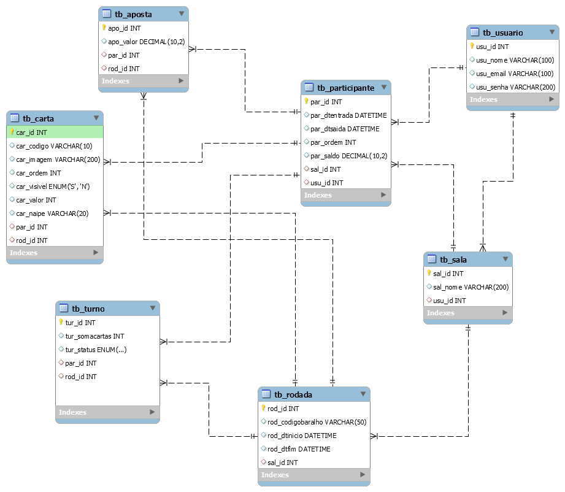

 ## Descrição

 Crie uma solução fullstack para uma plataforma de jogo multiplayer, o jogo a ser desenvolvido será o 21 (Blackjack). A solução deverá utilizar Next/React no frontend e Node/Express no backend.

 O sistema deverá permitir que o usuário crie uma conta e com essa conta tenha a possibilidade de criar a sala de jogo ou entrar em salas já existentes.

 Quando o usuário se tornar participante em uma determianda sala o jogo poderá ser iniciado.

 Todo o sistema deverá funcionar através do seguinte modelo de banco de dados:

 ## Competências funcionais

 A plataforma do jogo deverá ser dividida em duas partes: Área pública, e Área restrita:

 ### Área pública

 A área publica da plataforma deverá permitir:

 - Registro de um novo usuário;
- Autenticação (Login)
- Exibir uma página institucional sobre a plataforma FIPP21

 ### Área restrita

 A área restrita deverá ter as seguintes funcionalidades:

 - Criação de um nova sala de jogo;
- Exibir as salas do usuário;
- Entrar em uma sala através do código:
- Implementar as regras do jogo 21 (detalhado abaixo);
- Sair da sala;

 ## Competências tecnológicas

 ### Backend

 - Node/Express (API RESTful);
- Swagger;
- Middleware para validar as requisições (JWT)
- WebSocket (Para os eventos que acontecem no jogo);

 ### Frontend

 - Next/React;
- Middleware para validar a navegação das páginas;
- Context API para personalizar o acesso do usuário logado;
- WebSocket (Para os eventos que acontecem no jogo);

 ## Como o jogo irá funcionar?

 Quando algum participante entrar na sala o jogo será iniciado.

 Todos os participantes devem começar o jogo com 1000.

 Se um participante entrar na sala com um jogo em andamento, ele somente jogará na próxima rodada.

 Apenas participantes com saldo maior que 10 podem jogar.

 Cada jogo é composto por N rodadas e cada rodada será realizada seguindo as regras do 21.

 ## Regras do jogo

 O objetivo do 21, também conhecido como Blackjack, é obter uma pontuação maior que o dealer (crupiê) sem ultrapassar 21 pontos. Cada jogador compete individualmente contra o dealer, não entre si.

 ### Valores das Cartas

 - Cartas numéricas (2 a 10): valem seu valor nominal
- Figuras (Valete, Dama, Rei): valem 10 pontos cada
- Ás: vale 1 ou 11 pontos, conforme seja mais vantajoso para o jogador

 ## Mecânica do Jogo

 ### 1\. Início da Rodada

 Cada jogador faz sua aposta individual antes das cartas serem distribuídas. Os valores das apostas podem variar entre os participantes da mesma mesa.

 ### 2\. Distribuição Inicial

 Cada jogador recebe duas cartas viradas para cima (visíveis).

 O dealer recebe duas cartas: uma virada para cima (visível) e outra virada para baixo (oculta).

 ### 3\. Turno dos Jogadores

 Os jogadores decidem suas ações em ordem, um por vez. As opções disponíveis são:

 - Pedir carta (Hit): solicitar mais uma carta para aumentar sua pontuação
- Parar (Stand): manter sua pontuação atual e encerrar seu turno

 Os jogadores podem pedir quantas cartas desejarem, mas se a pontuação ultrapassar 21 pontos, o jogador "estoura" (bust) e perde automaticamente sua aposta, independentemente do resultado do dealer.

 ### 4\. Turno do Dealer

 Após todos os jogadores finalizarem suas jogadas, o dealer revela sua carta oculta e joga seguindo regras fixas:

 - Deve pedir carta (hit) obrigatoriamente com 16 pontos ou menos
- Deve parar (stand) obrigatoriamente com 17 pontos ou mais

 As cartas e o turno do dealer serão representadas deixando a coluna par\_id = null na tabela tb\_carta e tb\_turno

 ### 5\. Resolução e Pagamentos

 - Jogador tem pontuação maior que o dealer (sem estourar): jogador vence e recebe o valor de sua aposta de volta mais o mesmo valor em ganhos (proporção 1:1 aposta 50 -\> recebe 100 total)
- Jogador tem pontuação menor que o dealer: jogador perde sua aposta
- Jogador e dealer têm a mesma pontuação: empate (push), e o jogador recebe sua aposta de volta sem ganhos ou perdas
- Jogador estoura (passa de 21): perde imediatamente, mesmo que o dealer também estoure posteriormente
- Dealer estoura (passa de 21): todos os jogadores que não estouraram vencem automaticamente
- Blackjack natural: quando um jogador obtém exatamente 21 pontos com as duas cartas iniciais (um Ás e uma carta de valor 10), tradicionalmente recebe pagamento de 3:2 (aposta 50 -\> 125 total)

 ## Vantagem do Dealer

 A principal vantagem do dealer está no fato de que os jogadores jogam primeiro. Se um jogador estourar, ele perde imediatamente sua aposta, mesmo que o dealer também estoure na sequência. Esta regra garante a vantagem matemática do cassino no longo prazo.

 ## Observações Importantes

 - Múltiplos jogadores podem vencer simultaneamente na mesma rodada
- Cada jogador compete apenas contra o dealer, não contra os outros jogadores
- As decisões de um jogador não afetam os resultados dos demais participantes
- O dealer não tem poder de decisão, apenas segue as regras automáticas estabelecidas

 ## Baralho

 [https://deckofcardsapi.com/](<https://deckofcardsapi.com/>)

 Toda a parte do baralho deverá ser feita utilizando a api acima, nela vocês encontrarão endpoints para criar baralhos e comprar cartas de um determinado baralho. Dessa maneira, toda rodada terá um novo baralho (coluna rod\_codigobaralho) e quando os participantes estiverem jogando, as cartas serão compradas desse baralho.

 ### Criar um novo baralho

 Para gerar um novo baralho utilize o seguinte endpoint

 https://deckofcardsapi.com/api/deck/new/shuffle/?deck\_count=1

 ### Comprar cartas

 E para comprar a carta de um baralho:

 https://deckofcardsapi.com/api/deck/{codigoBaralho}/draw/?count=2

 O parâmetro count é a quantidade de cartas que eu quero "comprar".
